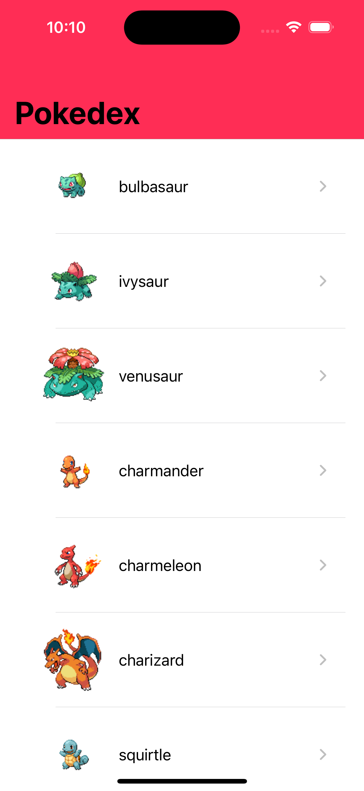
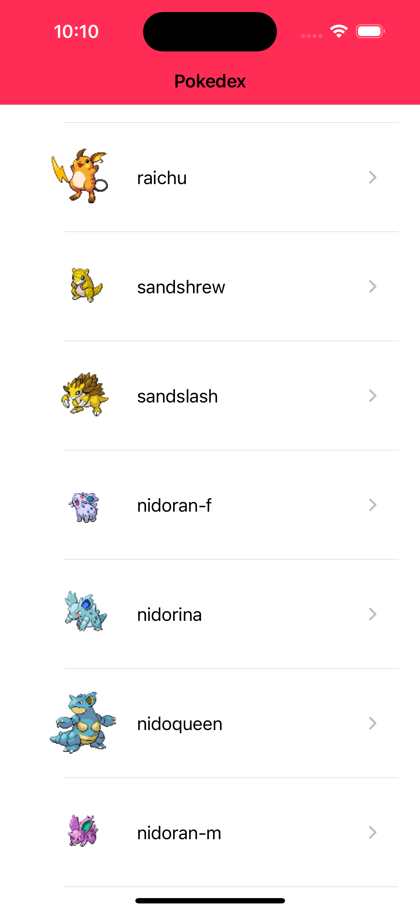
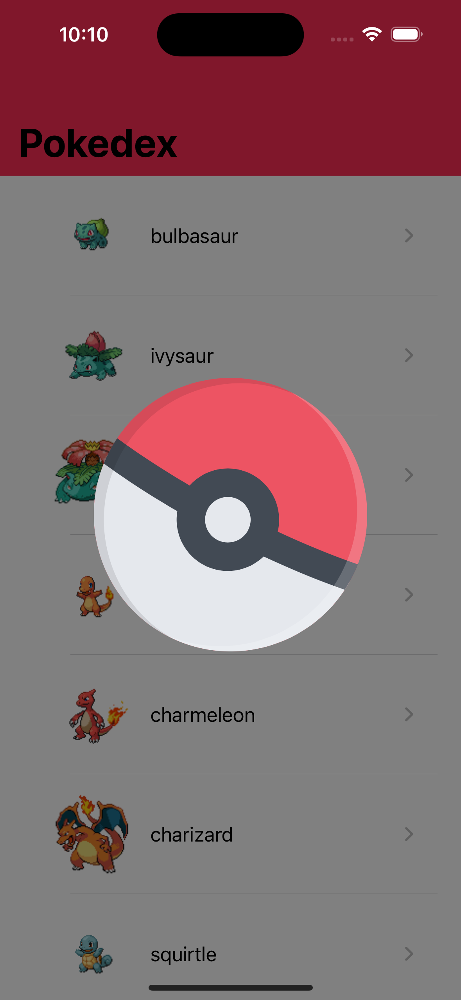
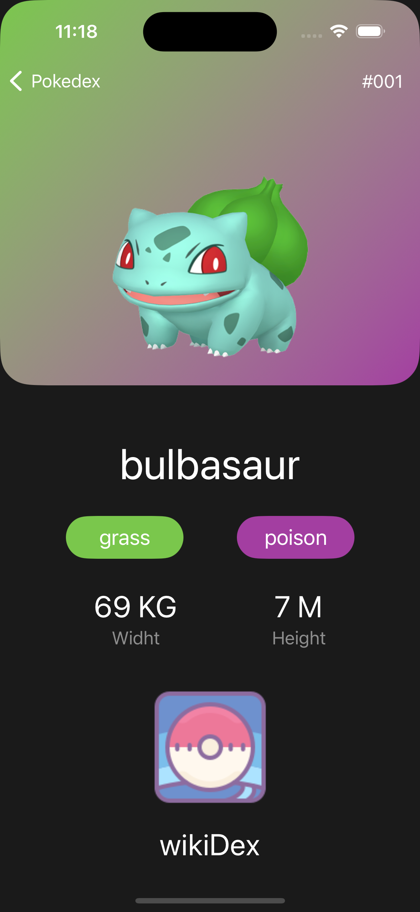
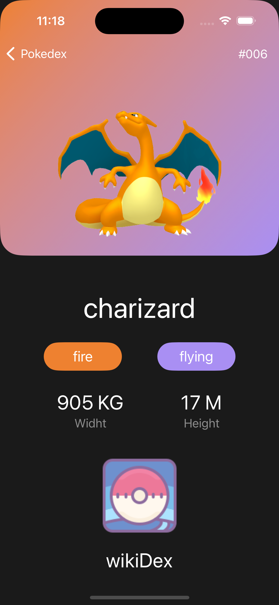
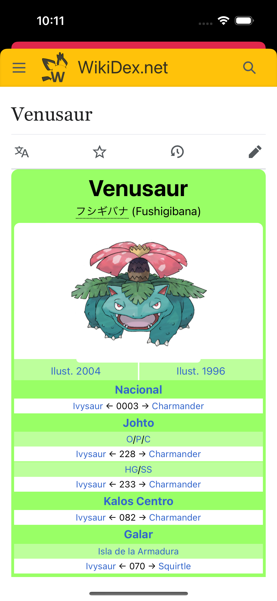

# Pokedex
This project is an implementation of SwiftUI using the MVVM design pattern and clean architecture. It includes unit testing, resource management, and data fetching from APIs with pagination.

### Project specs 

  - Xcode 15.2
  - Swift 5
  - macOS 14.3

### Librarys
#### SPM
  - [Moya](https://swiftpackageindex.com/Moya/Moya)
  - [Lottie](https://swiftpackageindex.com/airbnb/lottie-ios)
 
 ### Screenshots 
<table>
  <tr>
    <td> 
      
    </td>
    <td> 
      
    </td>
   <td> 
      
    </td>
    <td> 
      
    </td>
    <td> 
      
    </td>
    <td> 
      
    </td>
  </tr>
</table>
